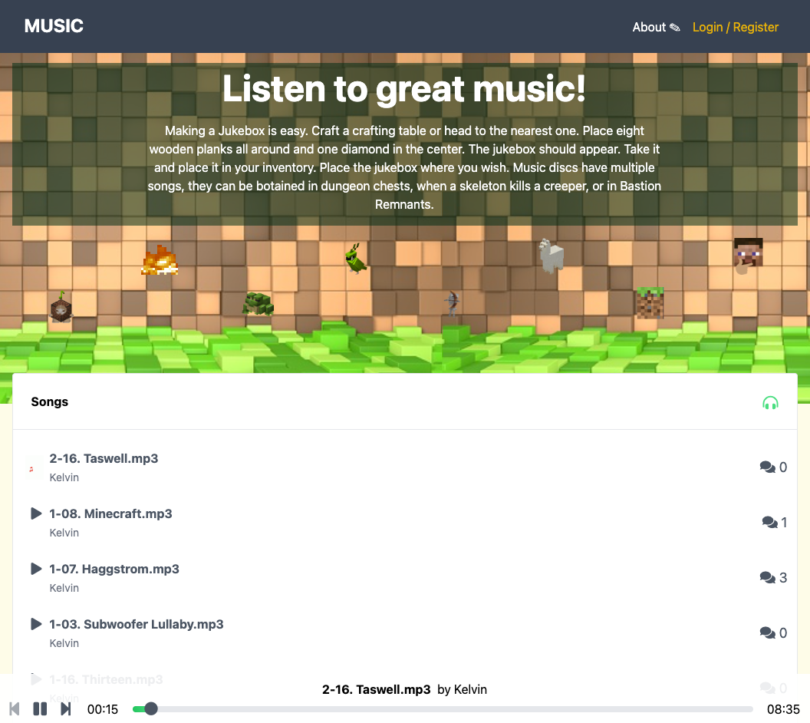
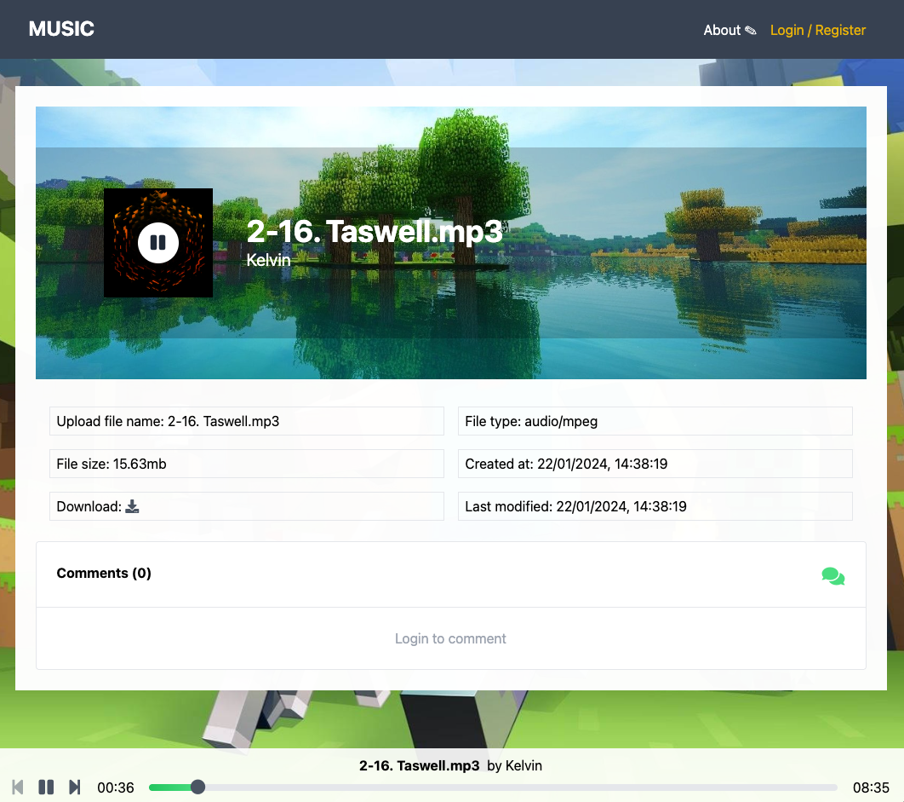

# Minecraft Jukebox Screenshots





# Firebase Hosting & GitHub Actions Instructions

Watch this Youtube link first:

Getting started with Firebase Hosting (and GitHub Actions!)

https://www.youtube.com/watch?v=P0x0LmiknJc

### • Domains

https://music-app-e50df.web.app

https://music-app-e50df.firebaseapp.com

✔ Created service account github-action-745356239 with Firebase Hosting admin permissions.

✔ Uploaded service account JSON to GitHub as secret FIREBASE_SERVICE_ACCOUNT_MUSIC_APP_E50DF.

i You can manage your secrets at https://github.com/ylli2000/minecraft-jukebox/settings/secrets.

### • Run emulators

`firebase emulators:start`

### • Deploy

`firebase deploy --only hosting`

### • Deploy Preview Channel

`firebase hosting:channel:deploy preview1 --expires 7d`

where preview1 is the id of the channel. You can list all the preview channels with:

`firebase hosting:channel:list`

│ preview1

│ Last Release Time

│ https://music-app-e50df--preview1-u7kmr9tq.web.app

│ Expire Time ...

To delete it, you can run:

`firebase hosting:channel:delete preview1`

### • CICD

`firebase init hosting:github`

? Set up the workflow to run a build script before every deploy? Yes

? What script should be run before every deploy? pnpm i && pnpm build

put the following in the workflow file to enable `pnpm`:

```
steps:
    - uses: actions/checkout@v4
    - uses: pnpm/action-setup@v2
    with:
        version: 8
    - run: pnpm i && pnpm build
    ...
```

Don't forget to also go to Github:

`Actions -> General -> Workflow permissions`

enable `Read and Write permissions` and Allow Github Actions to create and approbve PRs. and SAVE.

Now, you can create a new branch, and PR to `master` and see the workflow in action on GitHub page.

# Storage Rules

For Demo purposes, we allow all users to read ONLY, and write is RESTRICTED to the storage bucket.

You can re-enable it in your own Firebase project so that users can upload their own songs.

```json
rules_version = '2';

// Craft rules based on data in your Firestore database
// allow write: if firestore.get(
//    /databases/(default)/documents/users/$(request.auth.uid)).data.isAdmin;
service firebase.storage {
  match /b/{bucket}/o {

    // This rule allows anyone with your Storage bucket reference to view, edit,
    // and delete all data in your Storage bucket. It is useful for getting
    // started, but it is configured to expire after 30 days because it
    // leaves your app open to attackers. At that time, all client
    // requests to your Storage bucket will be denied.
    //
    // Make sure to write security rules for your app before that time, or else
    // all client requests to your Storage bucket will be denied until you Update
    // your rules
    match /{allPaths=**} {
      allow read: if true;
      allow write: if false;
      allow delete: if false;
      
      // allow write: if request.auth != null       
      // && request.resource.contentType.matches('^audio/.*') 
      // && request.resource.size < 50 * 1024 * 1024;
      
      // allow delete: if request.auth != null;
    }
  }
}
```